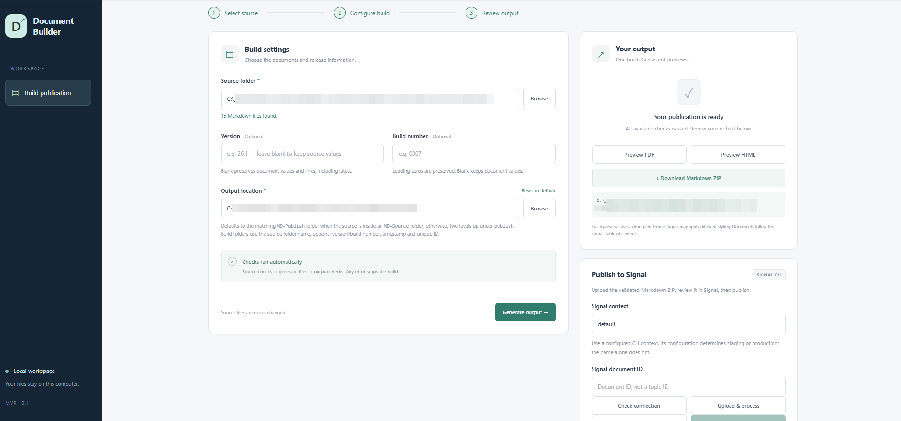

# Systems Portfolio

Alongside technical writing, I improve documentation workflows and build tools that make content easier to manage, clearer for readers, and better suited to AI systems.

Case studies:

- [Document Builder](#document-builder)
- [Madcap Flare to Markdown Migration](#madcap-flare-to-markdown-migration)
- [**Evaluating Documentation for AI Retrieval**](#evaluating-documentation-for-ai-retrieval)

## Document Builder

AI-assisted software development · Docs-as-code 

---

### Overview

- **Deliverable:** A local browser application that validates Markdown sources and generates a publication ZIP and HTML/PDF previews. 
Docsite publishing and version control support are planned.
- **Audience:** Technical writing team members
- **Tools and technologies:** Visual Studio Code, Codex, Python, Flask, JavaScript, HTML, and CSS.
- **Timeline:** Sept 17-24, 2026
- **My role:** Requirements definition, workflow and architecture planning, and direction and verification of AI-assisted implementation.

### The challenge

As part of our transition from [MadCap Flare to Markdown](#madcap-flare-to-markdown-migration), we needed a way to validate source content and generate publication-ready outputs. 

Individual scripts provided parts of that workflow, but their execution order, inputs and release settings needed to be coordinated.

I designed Document Builder to bring those steps into one repeatable workflow, with individually adjustable components to accommodate different project requirements.

### My approach

I mapped the required inputs, outputs and user flow, then defined the build sequence and the information each script needed to exchange.

I adapted clean architecture principles to separate content rules and build workflows from the UI, file handling and tools, so individual processing steps could be changed independently. Mapping dependencies and user flows helped identify requirements and change impacts, while pre- and post-build checks assess publication readiness before previews become available.


#### Key design decisions

- **Validation before and after generation.** 
Valid source files do not guarantee valid outputs: generation can introduce broken links, unresolved variables or incorrect PDF bookmarks. Source checks catch problems early; output checks verify the generated package. Reporting affected file paths helps writers troubleshoot without inspecting the code.
- **Reliable connections between scripts.**
Previously separate scripts used different parameter names and path assumptions. A shared input contract ensures every step uses the same source, output location, version and build number—including meaningful leading zeros such as `0007`. This also keeps release information consistent across the Markdown ZIP and previews.
- **Editable build steps.** 
Writers can modify individual scripts to meet their project’s needs, and the team can improve existing scripts or add new checks over time. A shared input contract and explicit execution order help those changes work consistently within the build process.

This separation proved useful after I shared the application with colleagues. A coworker contributed an updated PDF-generation script, which I substituted for the existing script without changing the UI or disrupting the build workflow.

#### File organization

```jsx
outputbuilder/
├── src/
│   └── document_builder/     Application code
│       ├── domain/           Document model and content rules
│       ├── application/      Build workflows and interfaces they require
│       ├── infrastructure/   File handling, rendering and script execution
│       ├── interfaces/       Browser request handlers, CLI and worker
│       ├── templates/        Browser UI HTML
│       └── static/           UI styles and JavaScript
│
├── functions/                Editable script bank
│   ├── pre-build_checks/     Validate source documents
│   ├── build/                Generate publication files and previews
│   └── post-build_checks/    Validate generated outputs
│
├── tests/                    Automated application and architecture tests
├── examples/                 Sample Markdown projects
├── dist/                     Generated builds and test outputs
├── artifacts/                Architecture diagrams and verification files
├── .venv/                    Local Python environment and dependencies
└── .git/                     Version history and repository settings
```

#### Testing

Testing was designed at two levels: **publication checks** that run during every build, and **software tests** that verify the tool itself. 

I refined both the severity and scope of validation. Repeated terminology produces advisory warnings, while ID and doc-link requirements apply only to TOC-linked topics.

| Area | Tests included |
| --- | --- |
| Source checks | Valid frontmatter, resolvable variables, unique IDs and valid doc-links for TOC-linked topics, and signs of content corruption |
| Script coordination | Consistent inputs and paths, correct execution order, preservation of leading zeros, and stopping when a step fails |
| Output checks | No unresolved variables, valid local links and assets, ZIP contents matching prepared files, correct document order and PDF bookmark destinations |
| Application behavior | Source files remain unchanged, previous builds are preserved, failed builds cannot enable previews, and errors identify affected paths |
| Architecture | Core layers remain independent of UI and infrastructure, and workflow behavior can be tested without running external tools |

#### Development and iteration

I directed AI-assisted implementation by defining build requirements, reviewing generated behavior and requiring tests for critical workflows. Iteration addressed inconsistent parameters, overly restrictive validation and PDF formatting defects, including lost line breaks in headings and callouts.

The project evolved from a command-line starter into a browser application with integrated generation, validation and previews. Automated tests covered script coordination, validation behavior, source preservation, and complete PDF and Markdown publication ZIP generation.

Initial corruption checks blocked legitimate repeated terminology and Markdown table separators. I changed repeated-text findings to advisory warnings and excluded formatting-only fragments, while retaining blocking checks for stronger corruption indicators.

### Results

The builder consolidates a workflow involving 20 scripts into one application, reducing manual execution and directory switching. Built-in sequencing and validation reduce reliance on writers remembering each publishing step.

I tested the builder on multiple real documentation projects and verified successful end-to-end generation of publication outputs. I also onboarded other writers, who have provided positive initial feedback and are adapting the scripts to their own project requirements. Broader adoption and time savings have not yet been measured.



GitHub is already used for version control. API publishing and enhanced GitHub integration, including batch commits across multiple versions, remain planned.

## Madcap Flare to Markdown Migration

Process Improvement · Documentation tooling 

---

### Overview

- **Deliverable:** Documentation migration and standardized publishing workflow
- **Audience:** Technical writing team members
- **Tools:** MadCap Flare, Markdown, Python, Git/GitHub
- **Timeline:** June 1, 2026 –June 28, 2026

This project demonstrates how I approach content systems: identify recurring friction, turn informal conventions into repeatable workflows, and automate quality checks where manual review does not scale.

### The challenge

At the beginning of June, I learned that my MadCap Flare subscription would expire at the end of the month. Because I had previously proposed migrating the documentation to Markdown, I was asked to complete the migration before the subscription ended.

**The project had two key constraints:**

- **Fixed deadline:** The migration needed to be completed before the Flare subscription expired.
- **Concurrent release work:** I was also writing new documentation for a major product release scheduled for early July.

**What I inherited:**

- My manager had completed an initial Flare-to-Markdown conversion and created a basic folder structure and migration workflow.
- Another writing team had experimented with PDF generation and established an initial process for combining Markdown files into a single PDF source.

These efforts provided a useful starting point, but the workflow still relied heavily on manual conventions and was not yet reliable enough for ongoing use.

**Key issues included:**

- **Cumbersome content ordering:** PDF order was controlled through numeric filename prefixes, so moving a topic often required renaming multiple files.
- **Broken links and assets:** Links to files and images were frequently broken during migration.
- **Encoding issues:** Mojibake characters appeared in migrated content.
- **Inconsistent table formatting:** Tables did not always convert or render correctly.
- **Broken links in PDF output:** PDF generation combined all Markdown files into a single file before export, but links to content in subfolders were not updated to account for the new file structure.

### My approach

I enacted the following:

- **Standardized file organization and naming.** Defined conventions for Markdown files and project folders. Filenames were standardized to lowercase to avoid case inconsistencies between Git and Windows, with exceptions where required by tooling, such as the `Templates` directory used by the Templater plugin.
- **Improved document assembly.** Modified the Markdown-combination script to determine document order from a dedicated `toc.md` file instead of numeric filename prefixes. Topics could then be moved, added, or removed by editing the TOC rather than renaming files.
- **Added automated validation.** Built Python checks for broken links, duplicate or missing page IDs, mojibake and encoding issues, and improperly converted variables. Added these checks to the publishing workflow.
- **Standardized the workflow.** Defined a consistent process for editing, validation, and output generation. Created internal documentation and a shared GitHub repository containing the tools, configuration, and instructions for other writers.

### Results

A subsequent migration of similar scope took approximately one week instead of three.

The processing and validation scripts also reduced the time required for recurring documentation checks by an estimated **75–90%** and caught migration issues before publication. This project demonstrates how I approach content systems: identify recurring friction, turn informal conventions into repeatable workflows, and automate quality checks where manual review does not scale.

The result was a more reliable process that was easier to use for subsequent migrations and ongoing documentation work.

## **Evaluating Documentation for AI Retrieval**

Knowledge architecture · AI retrieval evaluation

---

### Overview

- **Deliverable:** Content recommendations, structured metadata, and an exploratory evaluation
- **Audience:** Technical writers and the AI assistant development team
- **Tools:** Markdown, FortiAppSec Cloud AI Assistant, ChatGPT
- **Timeline:** June 15–August 30, 2026
- **My contribution:** Researched content practices, implemented metadata, designed test questions, and analyzed responses

### The challenge

FortiAppSec Cloud launched a beta AI assistant that uses product documentation among its knowledge sources to answer user questions. This gave our content two audiences: people reading it directly and AI systems retrieving information to answer questions.

I wanted to understand whether changes to content structure and metadata could improve AI answers while preserving the documentation’s usefulness to readers. That also required distinguishing problems in the source content from problems in how the assistant retrieved or used it.

### My approach

I consulted developers to understand how the assistant processed documentation and researched practices that could support retrieval.

I translated the findings into recommendations for technical writers:

- **Preserve context within sections.** Keep explanations meaningful when retrieved separately from the full page.
- **Make topics easier to identify.** Use descriptive headings, consistent terminology, natural search language, and structured metadata.
- **Keep essential information accessible and consistent.** Describe informative visuals with meaningful alt text and use shared snippets for repeated content.

I presented the recommendations to writers across the organization. During the [**Flare-to-Markdown migration**](#madcap-flare-to-markdown-migration), I also added structured metadata, creating an opportunity to evaluate responses before and after the changes.

#### Evaluation design

I compared the assistant’s answers before and after the migration and metadata integration, using questions across several scenarios:

- Basic factual lookup
- Cross-referencing information across topics
- Multi-step procedures
- Terminology disambiguation
- Negative and edge cases
- Complex configuration questions

**The source documentation was not rewritten to answer the test questions.** This helped keep the evaluation focused on the existing content and how the assistant used it.

> 
> 
> 
> *Illustrative example showing my evaluation approach. The scenario and answer summaries are fictional; no internal assistant responses or test results are reproduced.*
> 
> **Question:** “How do I connect an application to a monitoring service?”
> 
> | Evaluation element | Example |
> | --- | --- |
> | Expected information | Prerequisites, configuration steps, and a final verification step |
> | Answer A | Identifies the correct feature but leaves out prerequisites and verification |
> | Answer B | Provides a clearer sequence but still omits verification |
> | Assessment | Better organization does not necessarily mean a complete answer |
> | Next investigation | Check whether the verification guidance exists in the source, whether it reached the model, and whether the answer used it |

### Findings and implications

**Responses improved for 44%** of the questions tested. I treated this as an exploratory finding because some prompts differed between runs, responses could vary, and the migration and metadata changes occurred together. The evaluation did not establish which changes caused the improvement.

The findings informed practical content recommendations and identified areas for further investigation:

- **Retrieval quality:** How indexing and metadata affect which content is retrieved.
- **Multi-step retrieval:** Whether the assistant can find and combine information across topics.
- **Implementation tradeoffs:** How potential improvements balance accuracy, response time, token cost, development effort, and product requirements.

Reviewing the answers also revealed omissions of information explicitly stated in the documentation. This highlighted an important distinction for AI content strategy: **an incomplete AI answer does not necessarily indicate missing documentation.** These cases warranted investigation of retrieval and answer generation before deciding whether new content was needed.
