# Writing Portfolio

I create technical content that helps readers understand complex systems and make informed decisions. 

These selected projects demonstrate how I organize interconnected concepts, clarify configuration choices, and use diagrams to guide readers from understanding a system to applying it.

Case studies by type:

[Product Documentation](#product-documentation) 

- [Global Server Load Balancer Concept Guide](#global-server-load-balancer-concept-guide)
- [Web Application Firewall Onboarding Workflow](#web-application-firewall-onboarding-workflow)
- [Authentication Proxy Feature](#authentication-proxy-feature)

[Product Messaging](#product-messaging) 

- [Product Announcement Email](#product-announcement-email)
- [**Feature Copy in Different Styles**](#feature-copy-in-different-styles)

# Product Documentation

Technical guides and explanations that help cybersecurity B2B SaaS customers understand product features, make configuration decisions, and complete setup.

## Global Server Load Balancer Concept Guide

Conceptual documentation · Information architecture 

---

### Overview

- **Role:** Sole Technical Writer
- **Deliverable:** Concept guide
- **Audience:** Network and security engineers, IT administrators
- **Tools:** MadCap Flare, Obsidian, Figma
- **Timeline:** Proposed Fall 2025 · Initial approval Jan 2026 · Content direction approved Mar 2026 · Completed Jul 2026
- **Business context:** The guide was developed for a growing product area, with sales of bundles including GSLB up 47% year over year.

### The challenge

FortiAppSec Cloud is primarily a cloud-based web application firewall, with GSLB available under certain contracts. Existing documentation covered individual features and settings, but users lacked a unified explanation of how traffic distribution, health monitoring, DNS, and security work together.

I proposed a dedicated concept guide and initial table of contents to provide that foundation before users moved into configuration. Development progressed in stages alongside higher-priority release documentation.

### My approach

I independently planned, structured, and wrote the GSLB Concept Guide, creating all supporting visuals in Figma and consulting product SMEs to clarify system behavior and validate technical accuracy.

Key decisions included:

- **Organizing the guide from general concepts to specific applications.** Started with an overview, introduced core functionality, and then explored practical use cases.
- **Explaining system behavior through visuals and examples.** Used diagrams, comparisons, and scenarios to show how GSLB components and behaviors interact.
- **Connecting use cases to configuration choices.** Compared deployment scenarios and outlined recommended configurations, helping readers choose an approach before moving into detailed setup instructions.

#### Featured Sections

- **Explaining layered routing logic**
I separated traffic distribution into the two decision stages—selecting a virtual server pool, then selecting a server within that pool—and used scenarios and diagrams to explain how each stage affects routing.
    
    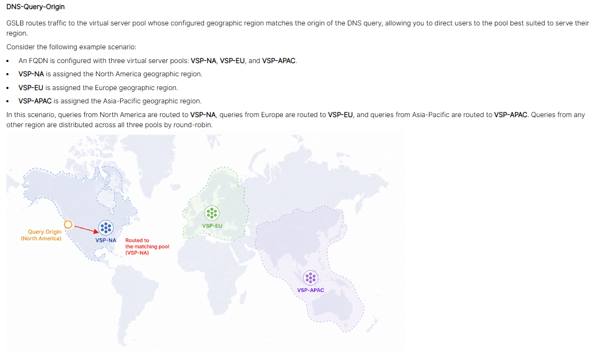
    
    [Read: Load Distribution Methods →](https://docs.fortinet.com/document/fortiappsec-cloud/26.3.0/gslb-concept-guide/577773/load-distribution-methods)
    
- **Distinguishing related features**
    
    Health checks help determine which servers can receive traffic, while synthetic testing provides visibility into application availability and performance.
    
    I introduced their shared purpose, compared their behavior, and then explained each workflow with diagrams to help readers understand when to use each feature and how both fit into GSLB’s monitoring functionality.
    
    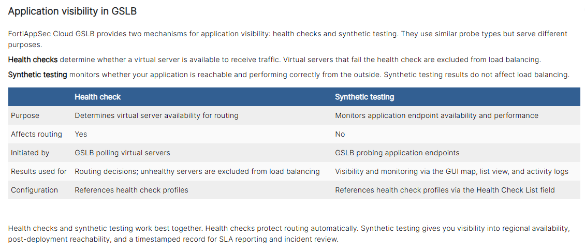
    
    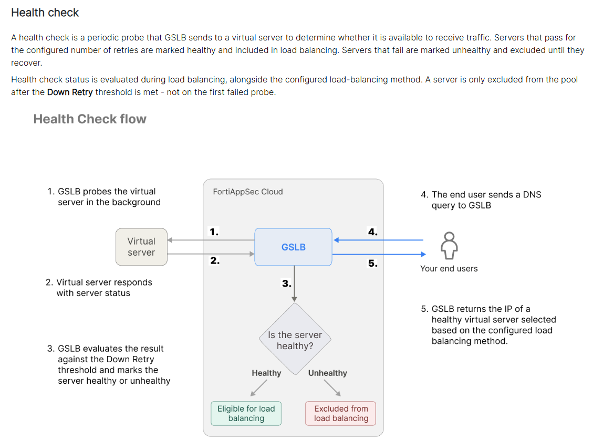
    
    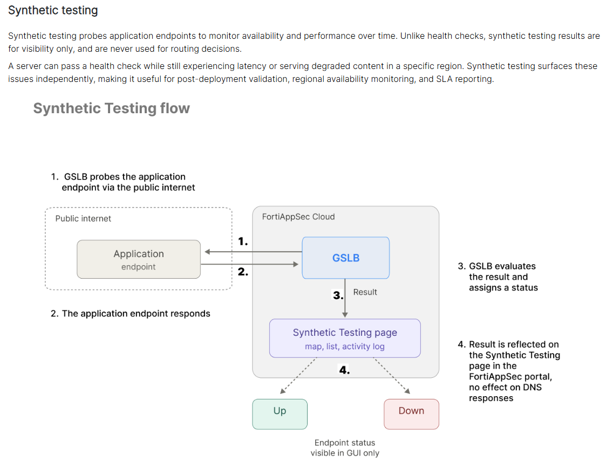
    
    [Read: Health Check and Synthetic Testing →](https://docs.fortinet.com/document/fortiappsec-cloud/26.3.0/gslb-concept-guide/605549/health-check-and-synthetic-testing)
    
- **Guiding deployment decisions**
    
    I introduced an uneven inbound-traffic problem, explained how DNS-based routing addresses it, and distinguished the deployment from VPN scaling and multisite load balancing. This helps readers recognize when the approach fits their environment.
    
    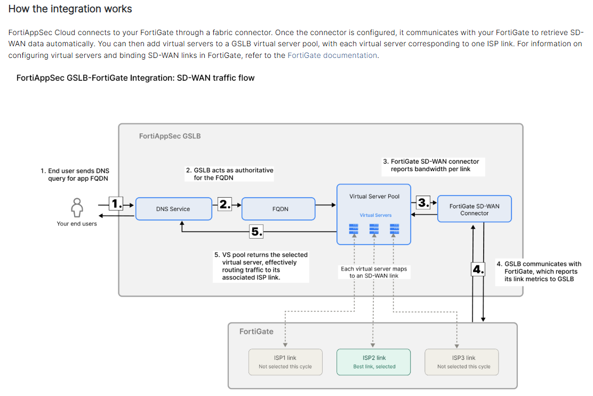
    
    [Read: FortiGate Integration for SD-WAN Inbound Optimization →](https://docs.fortinet.com/document/fortiappsec-cloud/26.3.0/gslb-concept-guide/321153/fortigate-integration-for-sd-wan-inbound-optimization)
    

### Early impact

Positive feedback from customers and sales teams indicated that the guide was useful in supporting product understanding and sales conversations.

## Web Application Firewall Onboarding Workflow

Procedural documentation · Configuration guidance 

---

### Overview

- **Role:** Sole Technical Writer
- **Deliverable:** End-to-end WAF onboarding documentation
- **Audience:** Network and security engineers, IT administrators
- **Tools:** MadCap Flare, Obsidian, Figma
- **Timeline:** Originally published January 2024 · Restructured July 2026 for Flare → Markdown migration
- **Collaboration:** Product management, engineering SMEs, UX

### The challenge

Onboarding a WAF application requires decisions about domains, origin servers, traffic routing, CDN behavior, security settings, and DNS. Some choices are difficult or impossible to reverse later.

The documentation needed to connect configuration steps with their consequences and explain the work required outside the product, including firewall prerequisites and DNS changes. Users needed enough context to make informed decisions and complete the full onboarding process.

### My approach

I structured the documentation around the user's complete onboarding journey. 

Key decisions included: 

- **Establishing the end-to-end mental model.** Introduced how traffic flows through FortiAppSec Cloud before asking users to configure the application.
    
    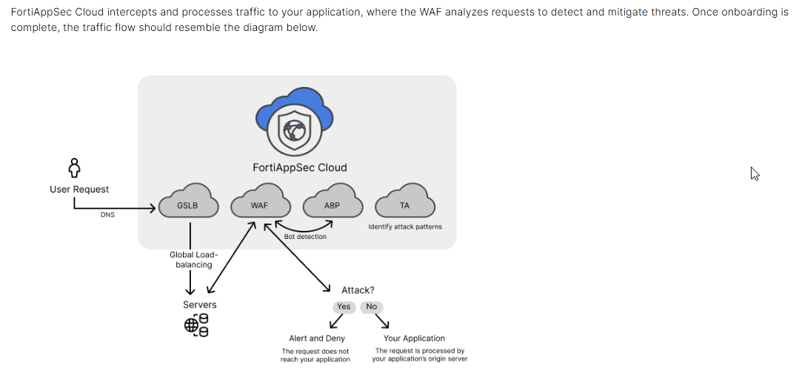
    
- **Adding context at decision points.** Explained the consequences of choices such as CDN enablement, cloud platform selection, and scrubbing-center selection instead of simply defining the controls. For example, the documentation distinguishes cost/compliance considerations from user-experience considerations when choosing CDN behavior.
    
    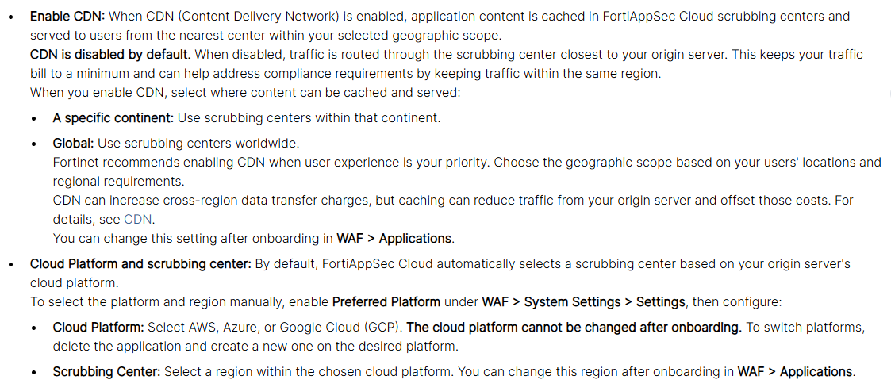
    
- **Extending the documentation beyond the product UI.** Explained the external DNS work required to actually route production traffic through the WAF, including different requirements for root and non-root domains.
    
    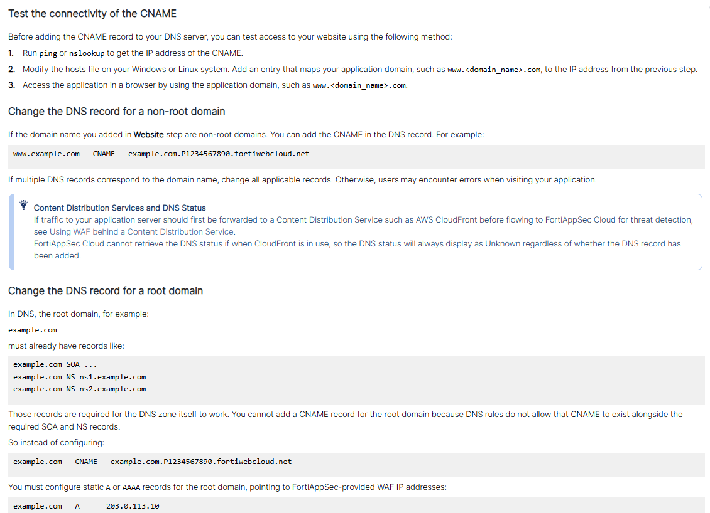
    
- **Documenting consequential edge cases.** Added dedicated guidance for multi-port applications, including a comparison of normal and multi-port onboarding and warnings about inherited CDN/region settings.
    
    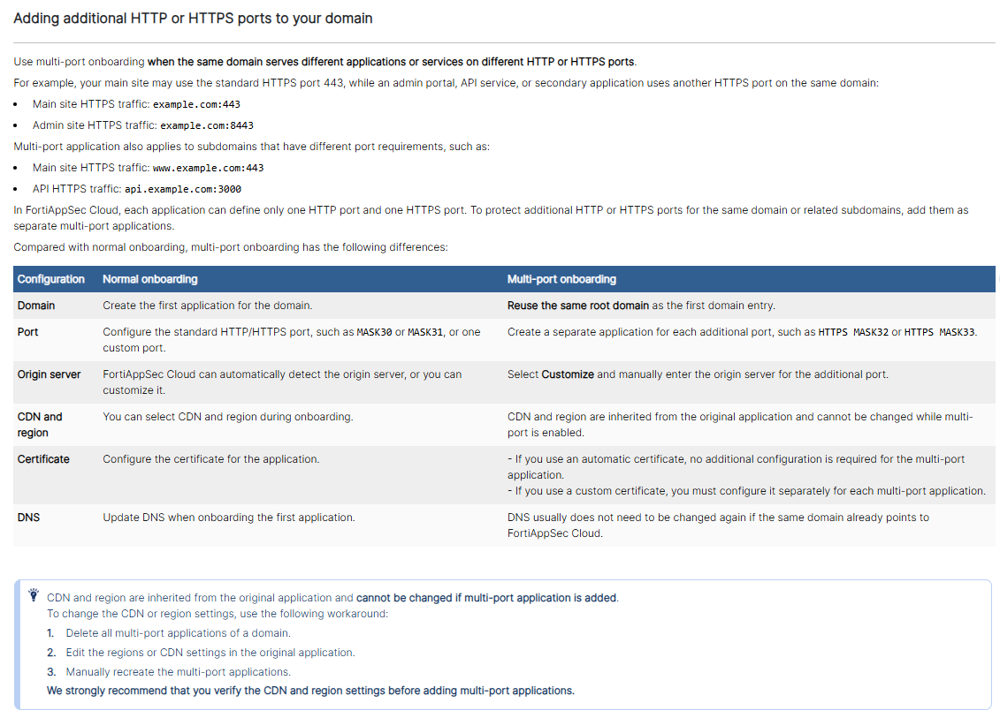
    

[Read: WAF Onboarding Wizard →](https://docs.fortinet.com/document/fortiappsec-cloud/latest/user-guide/032019/waf-onboarding-wizard)

## Authentication Proxy Feature

New feature documentation · Configuration guidance

---

### Overview

- **Role:** Sole Technical Writer
- **Deliverables:** New feature documentation and in-product feature announcement
- **Audience:** Network and security engineers, IT administrators
- **Tools:** MadCap Flare, Figma
- **Collaboration:** Product management, engineering SMEs, UX

### The challenge

The new Authentication Proxy feature required users to understand how FortiAppSec Cloud, external identity providers, and origin applications work together through SAML or OIDC. The documentation needed to connect individual settings to the overall authentication flow and help users adapt the configuration to their own application requirements. 

### The solution

I combined feature specifications, Teams discussions, UI designs, and SME input to understand the feature, identify missing information, and organize the documentation around customer goals.

Key decisions included:

- **Visualizing the end-to-end authentication flow.** Iterated on the relationships between the browser, FortiAppSec Cloud, the identity provider, and the origin application before creating the final sequence diagram.
    
    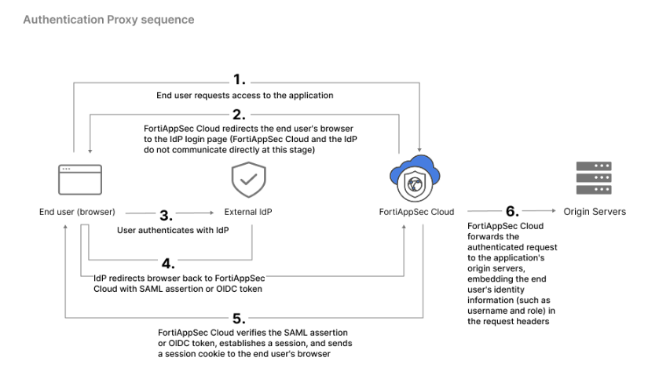
    
- **Establishing the mental model before configuration.** Explained FortiAppSec Cloud’s role as the service provider and distinguished SAML from OIDC before introducing protocol-specific settings.
    
    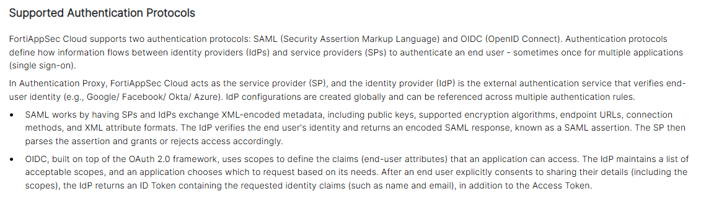
    
- **Placing explanations at decision points.** Kept conceptual guidance alongside the settings where users needed it to understand their configuration choices.
    
    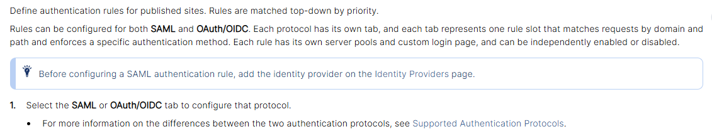
    
- **Highlighting dependencies and exceptions.** Documented identity provider prerequisites, conditional settings, objects configured on separate pages, and cases such as domains using nondefault ports.
    
    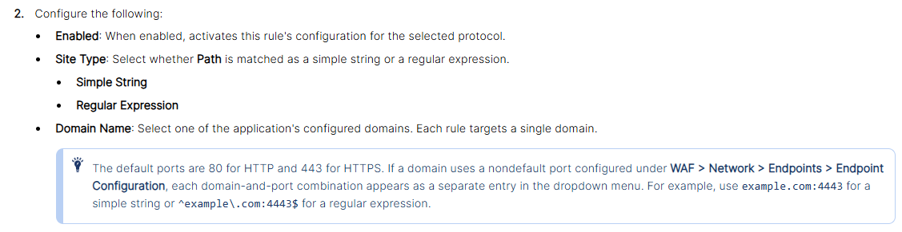
    
- **Explaining security controls through behavior and examples.** Showed how account lockout, session limits, and credential-stuffing defense work so readers could understand the effects of these settings.
    
    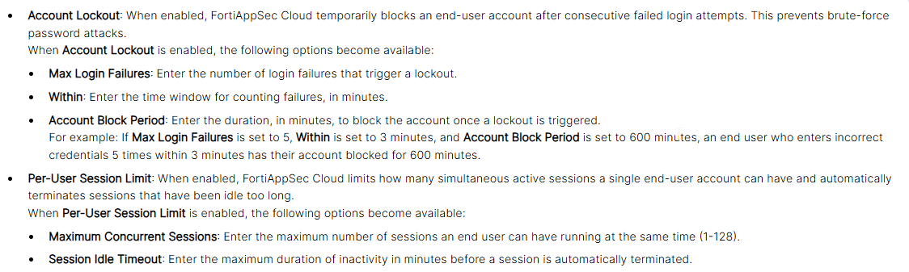
    

[Read: Authentication Proxy →](https://docs.fortinet.com/document/fortiappsec-cloud/latest/user-guide/356340/authentication-proxy)

# Product Messaging

Content that explores how audience, tone, and context shape a message.

## Product Announcement Email

Customer communications ·  Release messaging

---

### Overview

- **Role:** Sole Technical Writer
- **Audience:** Existing customers, typically business application administrators
- **Deliverable:** Customer email announcing a product transition
- **Timeline:** November, 2024
- **Collaboration:** Product management, engineering SMEs, marketing

### The challenge

Multiple products were being consolidated into a single platform, and customers needed clear guidance on how the transition would affect their services and what actions they needed to take, including updating API integrations, Terraform configurations, and access permissions.

### My approach

I separated service changes from required actions, emphasized continuity of application protection, and organized migration instructions so customers could quickly scan the communication and identify the steps relevant to them. 

Throughout, I maintained the company’s formal, authoritative voice to provide clear and consistent direction during the transition.

### Writing sample

The following is my proposed draft for one of the customer announcement emails. The final email incorporated input from other contributors and differed from this version.

> 
> 
> 
> Subject line: **ACTION REQUIRED: [Legacy Security Service] becomes [Unified Security Platform] on December 8**
> 
> ---
> 
> Dear [customer name],
> 
> On December 8, 2024, [Legacy Security Service] will become [Unified Security Platform], bringing [Legacy Security Service], [Global Load Balancing Service], and [Bot Protection Service] together in one SaaS platform.
> 
> The transition introduces a unified dashboard for service configuration and monitoring, along with more flexible user permissions.
> 
> Your application protection will continue during the transition. You may experience brief interruptions to portal access on launch day. Your contracts and application data will transfer automatically.
> 
> What you need to do
> 
> **Update your portal bookmarks on December 8.**
> 
> The services will move to [new platform URL], and the previous portal domains will be retired. The new portal will be available starting on launch day.
> 
> **Update API integrations by December 8.**
> 
> The API endpoint will change to [new API endpoint], with an updated URL structure. Update affected applications and API calls to avoid integration interruptions. See [API migration guide].
> 
> **Review your Terraform configuration.**
> 
> Update your Terraform modules for compatibility with the new platform. See [Terraform migration instructions].
> 
> **Review permissions after launch.**
> 
> In the IAM portal, review the newly created [Unified Security Platform] permission profiles to confirm that access matches your team’s needs.
> 
> **What happens to your contract?**
> 
> Your existing [Legacy Security Service] contract will provide access to [Unified Security Platform] until it expires. New standard and premium contract options will be available, and access to additional features may require a contract change.
> 
> For help with the transition, contact our team through the [Company Support Portal].
> 
> Thank you for your continued partnership.
> 
> The [Unified Security Platform] Team
> 

## **Feature Copy in Different Styles**

Self-directed exercise · Product copywriting

---

### Overview

In this self-directed exercise, I rewrote a feature description in several styles while keeping the core information consistent.

### Copy variations and analysis

#### Passive

> A new *Document Center* widget has been added to the *Home* page. Documents can be viewed and downloaded through the widget. Filters can be applied by document type or date.
> 

**What this style demonstrates**

The copy explains the feature accurately, but repeated passive constructions make it feel detached from the reader.

**When to use**

- **Audience:** Product, development, and support teams.
- **Placement:** Internal changelogs or release summaries.
- **Situation:** Recording newly available functionality for internal reference, with the emphasis on **what changed**. For customer-facing feature announcements, more direct wording would usually be a stronger choice.

#### Direct

> **New: Document center**
View and download documents from the *Document Center* widget on your *Home* dashboard. Filter documents by type or date.
> 

**What this style demonstrates**

The copy addresses the reader directly and uses action verbs to make the next steps clear. Concise sentences emphasize what users can do and where to do it, creating a confident, straightforward tone. Brands with a more conversational voice may prefer warmer wording.

**When to use**

- **Audience:**  Existing customers familiar with the dashboard.
- **Placement:** Release notes, *What’s new* sections, or in-app announcements.
- **Situation:** Introducing a straightforward feature when users need brief, practical instructions to start using it. Suits a **concise**, **practical** product voice.

#### Friendly

> **New: Document center**
You can now view and download your documents from your dashboard. Filter by document type or date to find what you need.
> 

**What this style demonstrates**

“You can now” introduces the feature as a new option for the reader. “Your documents” and “find what you need” make the message more **personal** and connect the feature to a familiar task. The wording adds warmth while remaining clear and professional.

**When to use**

- **Audience:** Existing customers familiar with the dashboard.
- **Placement:** Release notes, *What’s new* sections, or in-app announcements.
- **Situation:** Introducing a feature to users browsing product updates, with an emphasis on its everyday usefulness. Suits brands that favor approachable, conversational language.

#### Playful

> 
> 
> 
> **A new home for your paperwork**
> 
> Your documents are now right on your *Home* dashboard. View and download them through the *Document Center* widget, and filter by type or date to find the right one.
> 

**What this style demonstrates**

The headline uses wordplay around the *Home* dashboard to add personality. “Paperwork” and “right on your” carry a casual, conversational tone through the message. Precise product labels and clear action verbs keep the feature and its uses easy to understand.

**When to use**

- **Audience:** Customers familiar with a brand’s informal, conversational voice.
- **Placement:** *What’s new* sections, in-app announcements, or product update emails.
- **Situation:** Introducing a feature in a routine update, where light humor fits the brand’s established personality.

#### Benefit-led

> **Find the documents you need in one place**
> 
> 
> View and download documents right from your *Home* dashboard with the new *Document Center* widget. Filter by type or date to narrow your results.
> 

**What this style demonstrates**

The headline leads with the **reader’s goal**: finding a document. The body explains how dashboard access and filtering make that task easier, giving readers a practical reason to try the feature. 

Benefit-led writing changes the emphasis of a message and can work across different tones.

This approach can also support **marketing copy** by connecting a key product feature to a customer need or desired outcome. 

**When to use**

- **Audience:** Customers who need to locate and retrieve documents.
- **Placement:** *What’s new* sections, product update emails, or feature announcements.
- **Situation:** Encouraging customers to try a new feature by showing how it supports a familiar task. Useful when the feature name alone may not communicate its value.